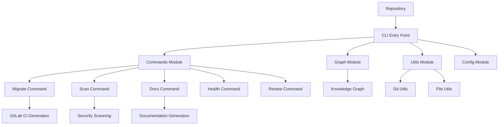

# System Architecture

This document describes the high-level architecture of the GitLab DevOps Companion CLI.

## Overview

The CLI is built as a modular Python application using Typer for command-line interface management.

## Architecture Diagram

## Components

- **CLI Entry Point**: Main application entry using Typer
- **Commands Module**: Individual command implementations
- **Graph Module**: Knowledge graph utilities using NetworkX
- **Utils Module**: Helper functions for Git and file operations
- **Config Module**: Configuration management

## Data Flow

1. User runs CLI command
2. Typer routes to appropriate command handler
3. Command processes repository data
4. Results are displayed or files are generated
